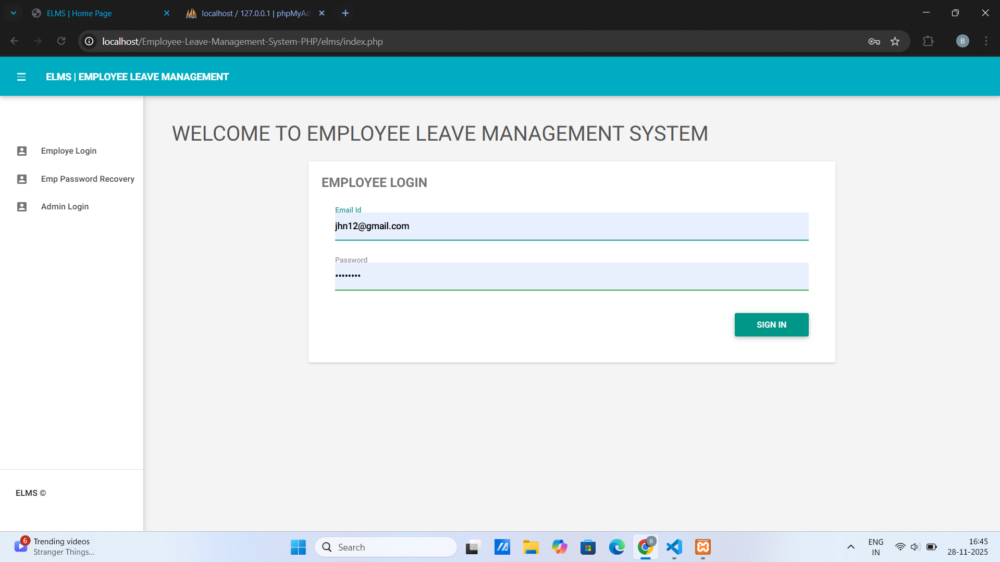
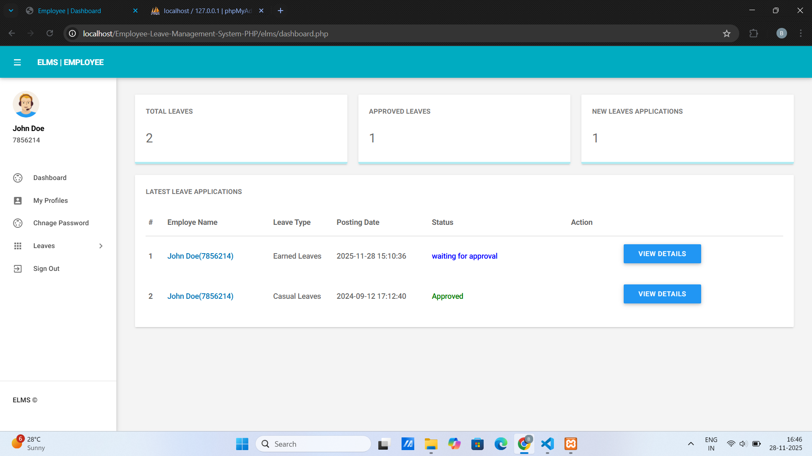
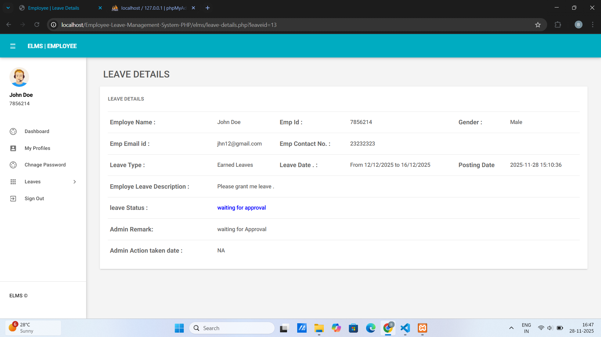
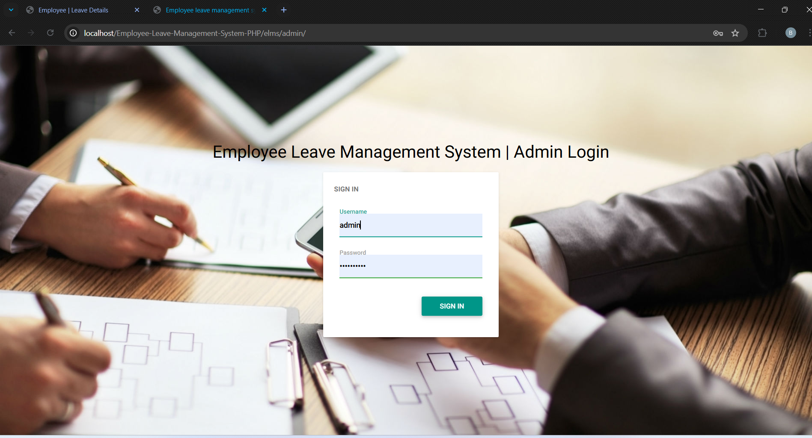
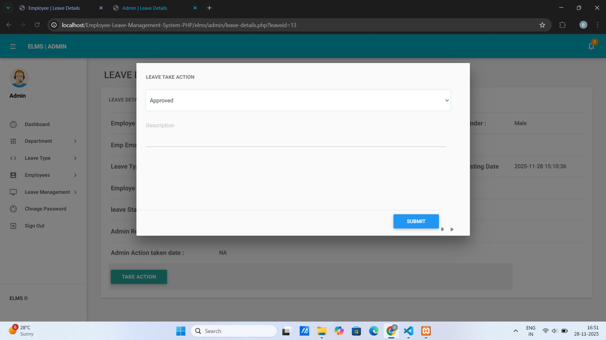
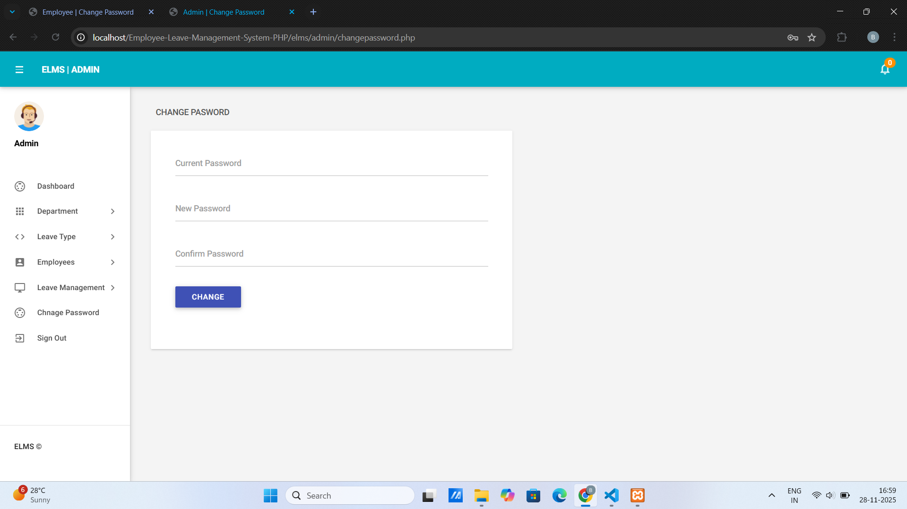
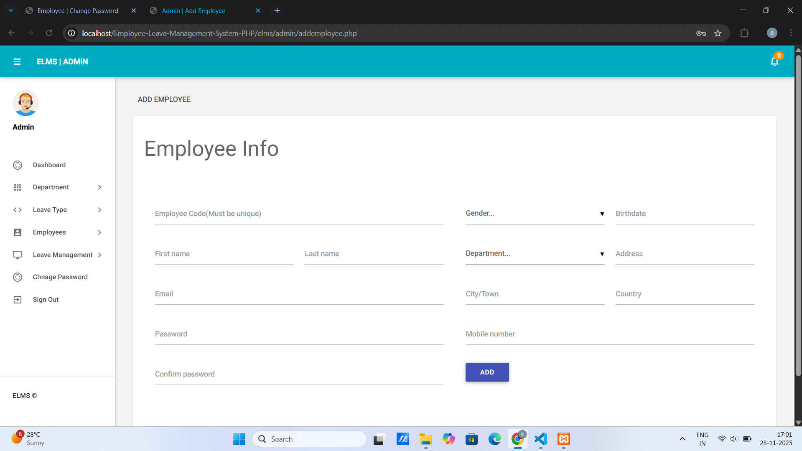
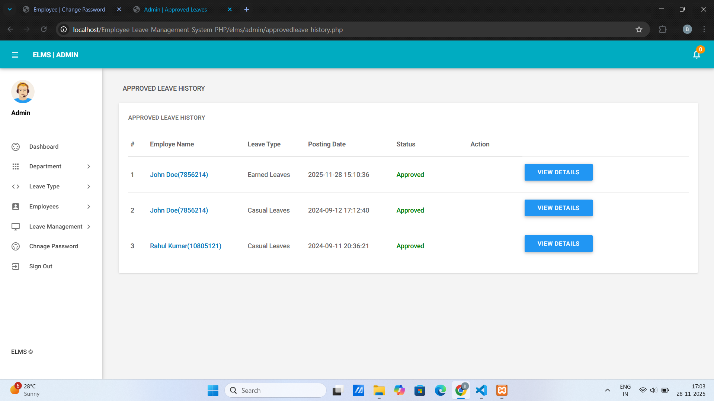
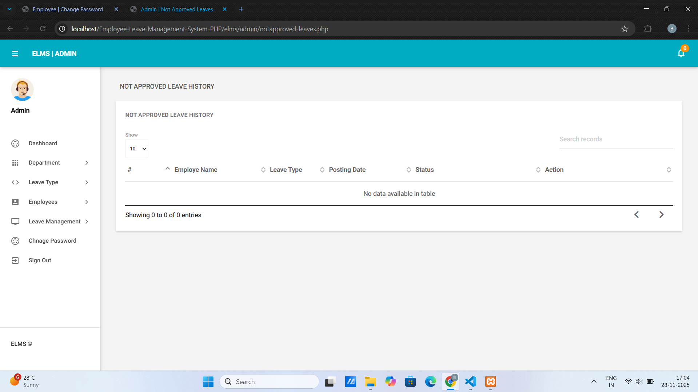
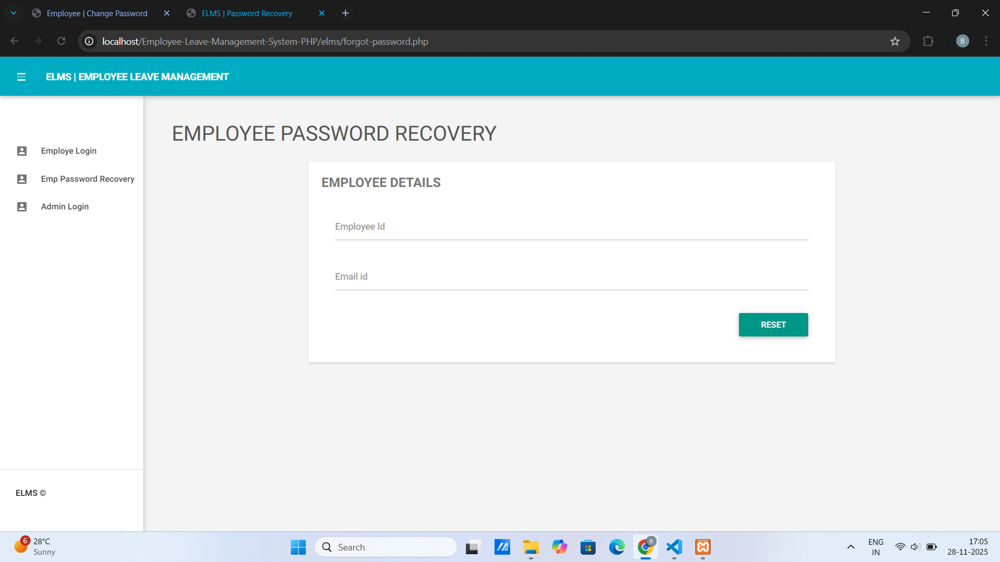

### 🚀Employee Leave Management System

A complete Leave Management System built using PHP, MySQL, HTML, CSS, JavaScript, and Bootstrap.
Designed for seamless leave application, tracking, and administration.

### ⭐ Feature

👨‍💼 Employee & Admin authentication

📝 Apply for leave (Casual, Sick, Earned, RH, etc.)

✔ Approve / Reject leave (Admin panel)

📊 View leave history

🗂 Manage departments & leave types

🔐 Secure login system

🎨 Responsive UI using Bootstrap

🗄 MySQL database for all records

### 🛠️ Tech Stack (Implementation)
**Frontend**

🟦 HTML
🎨 CSS
⚡ JavaScript
💠 Bootstrap

**Backend**

🐘 PHP (Core PHP)

**Database**

🗄 MySQL / MariaDB

**Tools**

🖥 XAMPP / WAMP / Laragon
🗃 phpMyAdmin

### 📸 Output (Screenshots)

### Employee Login

### Employee dashboard

### Leave Application of Employee

### Admin Login

### Admin Dashboard After Login

### Applied Leave by an Employee

### [Admin Approving Leave

### Admin Not Approving the Leave

### Action Taken By Admin

### Employee Gets Notified about Approval

### Admin can change his Password

### Admin can add departments

### Admin can manage already existing departments

### Admin can add Employees

### Admin can manage already existing Employees

### Admin Dashboard For all Leaves

### Pending Leave Dashboard For Admin

### Approved Leave dashboard for admin

###  Not Approved Leave dashboard for admin

### Employee Password Recovery

### 🧩 Database Schema

Admin table
-----------

| Column Name  | Data Type    | Description            |
| ------------ | ------------ | ---------------------- |
| id           | INT (PK)     | Admin ID               |
| UserName     | VARCHAR(100) | Admin username         |
| Password     | VARCHAR(100) | MD5 hashed password    |
| updationDate | TIMESTAMP    | Last updated timestamp |

tbldepartments
--------------

| Column Name         | Data Type    | Description            |
| ------------------- | ------------ | ---------------------- |
| id                  | INT (PK)     | Department ID          |
| DepartmentName      | VARCHAR(150) | Full department name   |
| DepartmentShortName | VARCHAR(100) | Short name             |
| DepartmentCode      | VARCHAR(50)  | Unique department code |
| CreationDate        | TIMESTAMP    | Timestamp              |

tblemployees
------------

| Column Name | Data Type    | Description         |
| ----------- | ------------ | ------------------- |
| id          | INT (PK)     | Employee ID         |
| EmpId       | VARCHAR(100) | Employee code       |
| FirstName   | VARCHAR(150) | First name          |
| LastName    | VARCHAR(150) | Last name           |
| EmailId     | VARCHAR(200) | Email address       |
| Password    | VARCHAR(180) | MD5 hashed password |
| Gender      | VARCHAR(100) | Gender              |
| Dob         | VARCHAR(100) | Birth date          |
| Department  | VARCHAR(255) | Department          |
| Address     | VARCHAR(255) | Address             |
| City        | VARCHAR(200) | City                |
| Country     | VARCHAR(150) | Country             |
| Phonenumber | CHAR(11)     | Phone number        |
| Status      | INT(1)       | 1 = Active          |
| RegDate     | TIMESTAMP    | Registration date   |

tblleaves
---------

| Column Name     | Data Type    | Description                     |
| --------------- | ------------ | ------------------------------- |
| id              | INT (PK)     | Leave ID                        |
| LeaveType       | VARCHAR(110) | Leave category                  |
| ToDate          | VARCHAR(120) | Leave end date                  |
| FromDate        | VARCHAR(120) | Leave start date                |
| Description     | MEDIUMTEXT   | Leave description               |
| PostingDate     | TIMESTAMP    | Submitted timestamp             |
| AdminRemark     | MEDIUMTEXT   | Admin remarks                   |
| AdminRemarkDate | VARCHAR(120) | Date admin updated              |
| Status          | INT(1)       | 0=pending,1=approved,2=rejected |
| IsRead          | INT(1)       | Read status                     |
| empid           | INT (FK)     | Employee ID                     |

tblleavetype
------------

| Column Name  | Data Type    | Description   |
| ------------ | ------------ | ------------- |
| id           | INT (PK)     | Leave type ID |
| LeaveType    | VARCHAR(200) | Category name |
| Description  | MEDIUMTEXT   | Description   |
| CreationDate | TIMESTAMP    | Timestamp     |

 
### ⚙️Setup Instructions

Install XAMPP/WAMP/Laragon

Move project folder to:

htdocs/

Create a database named:

elmsdb

Import the elmsdb.sql file

Update database connection in config.php

Start Apache & MySQL

Run the project in browser:

http://localhost/Employee-Leave-Management-System/

### 🔐 Default Login Credentials

**Admin Credential**

Username: admin
Password: Test@12345

**Credential for User Panel**

Username: jhn12@gmail.com
Password: Test@123

EmpID: 7856214 (Used for password recovery)

👉 Or Register a New User

### 📁 Project Structure

 project-root/
├── admin/
│   ├── dashboard.php
│   ├── manage-leaves.php
│   ├── manage-departments.php
│   ├── manage-leave-type.php
│   └── ...
├── employee/
│   ├── apply-leave.php
│   ├── leave-history.php
│   └── ...
├── includes/
│   ├── config.php
│   ├── header.php
│   └── sidebar.php
├── images/
├── database/
│   └── elmsdb.sql
├── index.php
└── README.md

### 👨‍💻 Credits

**Developed By:**
**👤 Bhagwat Hiwale**
**👤 Om Gujar**

### 📜 MIT License

This project is licensed under the MIT License.
You are free to use, modify, distribute, with proper attribution.
